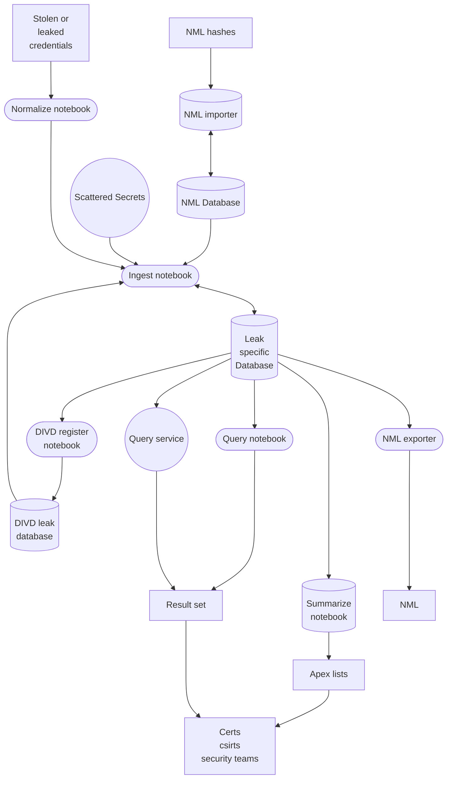
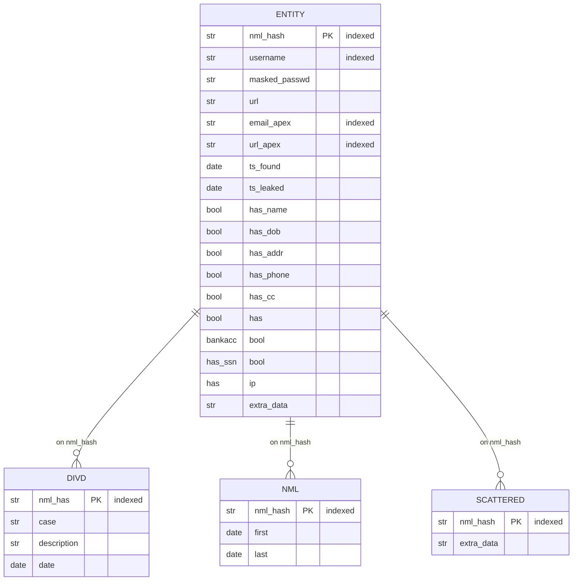
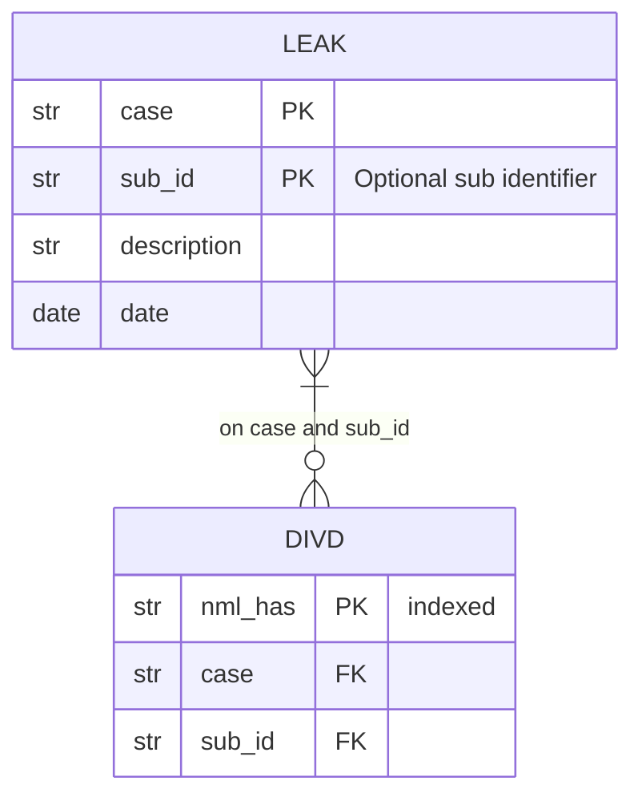

# Stolen Credentials Pipeline

A first attempt at a pipeline for processing stolen credentials for DIVD CSIRT

# Overview

The pipeline has the followign flow:

## Stolen or leaked credentials

This is a set of stolen and/or leaked credentials, obtained by DIVD in line with the [credentials policy](https://csirt.divd.nl/credentials).

## Normalize notebook

The normalize notebook is a notebook that attempts to normalize the data to one or more csv files with the following fields:
* username
* passwd
* url (Url that the credentials belong to)
* ts_found (Timestamp when the data was "found")
* ts_leaked (Timestamp when the data was stolen/leaked)
* has_name (0/1 if the record has a name)
* has_dob  (0/1 if the record has a date of birth)
* has_addr (0/1 if the record has a address)
* has_phone (0/1 if the record has a )
* has_cc (0/1 if the record has creditcard data)
* has bankacc (0/1 if the record has a bank account)
* has_ssn  (0/1 if the record has a ssn)
* has ip (0/1 if the record has an ip address)
* extra_data (json object with extra data)

Thre is no single Jupyter notebook that works for all formats, but the generic normalize notebook in this repo contains helper functions that are usefull.

## Ingest notebook

The ingest notebook takes care of the following tasks:
* normalizing the username to lowercase utf8 NFC normalisation
* masking the password
* calculating a nml_hash
* determine the apex of username
* determine the apex of url
* Ingesting the data into a leak specific database and storing results
* checking the nml_hash agaist the divd database of earlier breaches
* checking the nml_hash against the nml_database (future)
* checking the nml_hash against the Scattered Secrets service (future)

## Leak Specific Database looks as follows

All indexes are created `collate nocase` this should be used in queries as well to get the best speed results.

## DIVD register notebook

The DIVD register notebook takes the data from the leak specific database and registers it in the DIVD leak database of leaks. WHich is stored in a (TODO) central location.

This database only contains records for which a nml_hash could be calculated

## DIVD leak database

The DIVD leak database looks as follows:

## Summarize notebook

This notebook turns a leak_db into two csv files.

### email_apex_summary.csv

Contains:
* email_apex (apex of the username (if it is an email)
* count_of_unique_username_password entries (nml_hashes actually)

### url_apex_summary.csv

Contains:
* url_apex (apex of the url that the credentials belong to)
* cont_of_unique_usernames

## Query service (future)

TBD

## Query notebook

Takes a list of apexes and exports two cvs per apex

### \<apex\>-email-hits.csv

Records where `email_apex` matches \<apex\>. It has the following records:
* username
* masked_passwd
* url
* ts_found
* ts_leaked
* has_name
* has_dob
* has_addr
* has_phone
* has_cc
* has bankacc
* has_ssn
* has ip 
* extra_data
* divd_previous (list of earlier DIVD breaches)
* in_nml (0/1 if data is in nml)
* nml_first (first date seen in nml by us)
* nml_last (last seen in nml by us)

### \<apex\>-url-hits.csv

Records where `url_apex` matches \<apex\>. Same fields as above.

## NML importer and exported

Future tbd.

